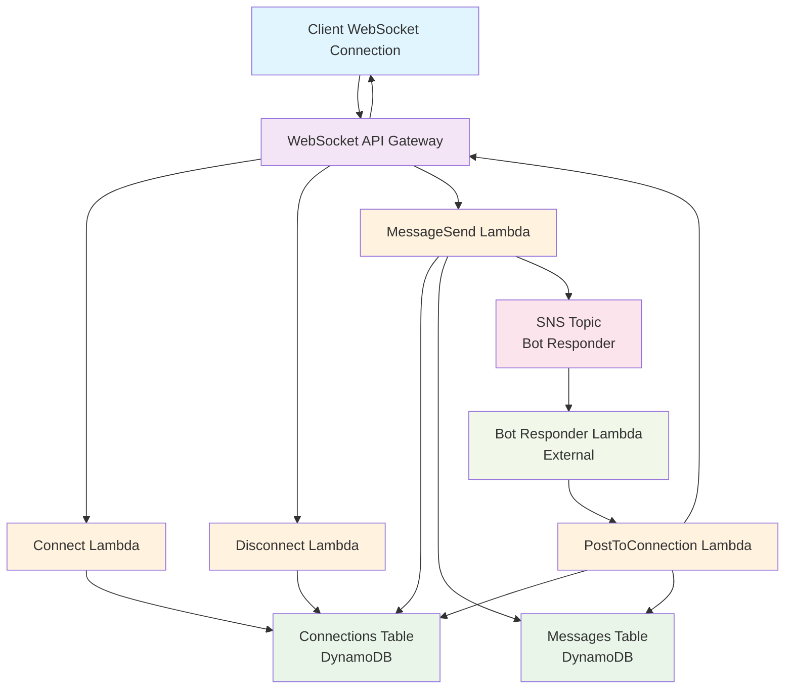
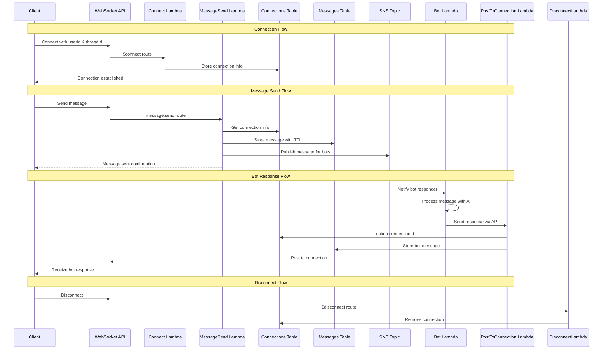
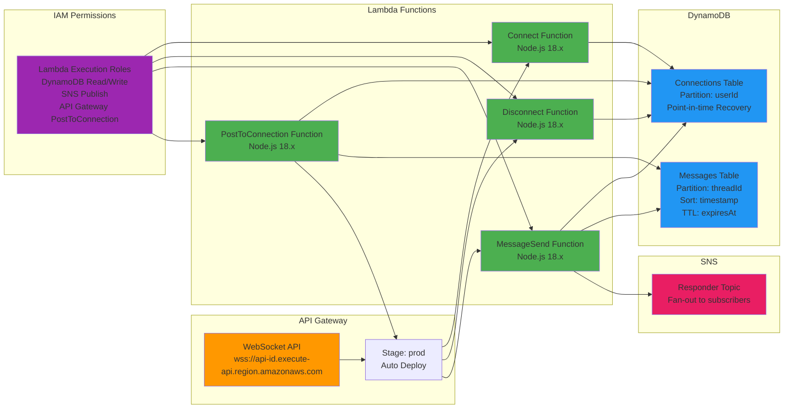

# @toldyaonce/kxgen-chat-server

A reusable AWS CDK construct for deploying real-time chat server infrastructure with WebSocket API, Lambda functions, DynamoDB tables, and SNS integration for bot responders.

## Features

- **WebSocket API** with API Gateway for real-time communication
- **Lambda Functions** for connect/disconnect/message handling
- **DynamoDB Tables** for message persistence and connection tracking
- **SNS Topic** for bot responder integration
- **Message TTL** for automatic cleanup (configurable, default: 90 days)
- **Human Takeover** support via connection flags
- **Utility Functions** for sending responses via WebSocket

## Installation

```bash
npm install @toldyaonce/kxgen-chat-server
```

## Quick Start

```typescript
import { App } from 'aws-cdk-lib';
import { createChatInfraStack } from '@toldyaonce/kxgen-chat-server';

const app = new App();

const chatStack = createChatInfraStack(app, 'MyKXGenChatStack', {
  domain: 'chat.example.com',
  snsTopicName: 'my-chat-responder',
  messageRetentionDays: 90, // Optional, defaults to 90
  env: {
    account: process.env.CDK_DEFAULT_ACCOUNT,
    region: process.env.CDK_DEFAULT_REGION,
  },
});
```

## Architecture

### High-Level Architecture



### Data Flow Diagram



### Database Schema

```mermaid
erDiagram
    MESSAGES {
        string threadId PK
        number timestamp SK
        string messageId
        string messageType
        string text
        string sender
        string status
        object metadata
        number expiresAt
    }
    
    CONNECTIONS {
        string userId PK
        string connectionId
        string threadId
        number lastSeen
        boolean isHumanOverride
    }
    
    MESSAGES ||--o{ CONNECTIONS : "threadId"
```

### AWS Infrastructure Components



### WebSocket API Routes

- **$connect** - Establishes connection, requires `userId` and `threadId` query parameters
- **$disconnect** - Cleans up connection records
- **message.send** - Handles user messages, stores them, and publishes to SNS

### DynamoDB Tables

#### Messages Table
- **Partition Key**: `threadId`
- **Sort Key**: `timestamp`
- **TTL**: `expiresAt` (configurable retention period)
- **Attributes**: `messageType`, `text`, `sender`, `status`, `metadata`

#### Connections Table
- **Partition Key**: `userId`
- **Attributes**: `connectionId`, `threadId`, `lastSeen`, `isHumanOverride`

### SNS Integration

The stack publishes messages to an SNS topic that bot responders can subscribe to:

```json
{
  "message": {
    "messageId": "uuid",
    "threadId": "thread-123",
    "messageType": "user",
    "text": "Hello!",
    "sender": "user@example.com",
    "timestamp": 1234567890,
    "status": "sent",
    "metadata": {}
  },
  "connection": {
    "userId": "user-123",
    "connectionId": "abc123",
    "threadId": "thread-123",
    "lastSeen": 1234567890,
    "isHumanOverride": false
  },
  "requestMetadata": {
    "connectionId": "abc123",
    "userId": "user-123",
    "timestamp": 1234567890
  }
}
```

## Usage Examples

### Connecting to WebSocket

```javascript
const ws = new WebSocket('wss://your-api-id.execute-api.region.amazonaws.com/prod?userId=user123&threadId=thread456');

ws.onopen = () => {
  console.log('Connected to chat server');
};

ws.onmessage = (event) => {
  const message = JSON.parse(event.data);
  console.log('Received:', message);
};
```

### Sending Messages

```javascript
ws.send(JSON.stringify({
  action: 'message.send',
  threadId: 'thread-456',
  text: 'Hello, world!',
  sender: 'user@example.com',
  metadata: {
    userAgent: navigator.userAgent
  }
}));
```

### Bot Responder Lambda

```typescript
import { SNSHandler } from 'aws-lambda';
import { ApiGatewayManagementApiClient, PostToConnectionCommand } from '@aws-sdk/client-apigatewaymanagementapi';

export const handler: SNSHandler = async (event) => {
  for (const record of event.Records) {
    const payload = JSON.parse(record.Sns.Message);
    
    // Process the message with your bot logic
    const response = await processWithBot(payload.message.text);
    
    // Send response back via the postToConnection function
    const postResponse = await fetch('https://your-post-to-connection-api/invoke', {
      method: 'POST',
      body: JSON.stringify({
        userId: payload.connection.userId,
        threadId: payload.message.threadId,
        message: {
          messageId: generateId(),
          threadId: payload.message.threadId,
          messageType: 'bot',
          text: response,
          sender: 'bot',
          timestamp: Date.now(),
          status: 'sent'
        }
      })
    });
  }
};
```

### Human Takeover

To enable human takeover for a specific user:

```typescript
import { DynamoDBClient } from '@aws-sdk/client-dynamodb';
import { DynamoDBDocumentClient, UpdateCommand } from '@aws-sdk/lib-dynamodb';

const dynamoClient = new DynamoDBClient({});
const docClient = DynamoDBDocumentClient.from(dynamoClient);

// Enable human override
await docClient.send(new UpdateCommand({
  TableName: 'kxgen-chat-connections',
  Key: { userId: 'user-123' },
  UpdateExpression: 'SET isHumanOverride = :override',
  ExpressionAttributeValues: {
    ':override': true
  }
}));
```

## Configuration Options

```typescript
interface ChatStackProps extends StackProps {
  domain: string;                    // Required: Domain for the WebSocket API
  snsTopicName?: string;            // Optional: SNS topic name (default: 'kxgen-chat-responder')
  messageRetentionDays?: number;    // Optional: Message TTL in days (default: 90)
}
```

## Advanced Usage

### Accessing Individual Resources

```typescript
import { ChatInfraStack } from '@toldyaonce/kxgen-chat-server';

const stack = new ChatInfraStack(app, 'ChatStack', props);

// Access individual resources
const webSocketUrl = stack.webSocketApi.apiEndpoint;
const topicArn = stack.responderTopic.topicArn;
const messagesTableName = stack.messagesTable.tableName;
```

### Custom Lambda Integration

```typescript
import { createResponderTopic, createMessagesTable } from '@toldyaonce/kxgen-chat-server';

// Use individual components
const topic = createResponderTopic(this, 'MyTopic');
const table = createMessagesTable(this, 30); // 30 days retention
```

## Security

- All Lambda functions use least-privilege IAM roles
- DynamoDB tables have point-in-time recovery enabled
- WebSocket connections require userId and threadId parameters
- Stale connections are automatically cleaned up

## Contributing

1. Fork the repository
2. Create a feature branch
3. Make your changes
4. Add tests
5. Submit a pull request

## License

MIT